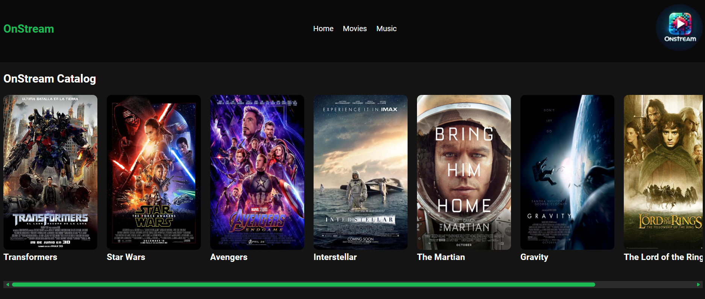
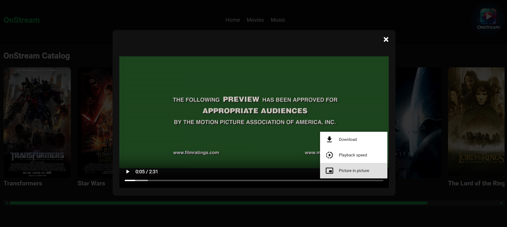
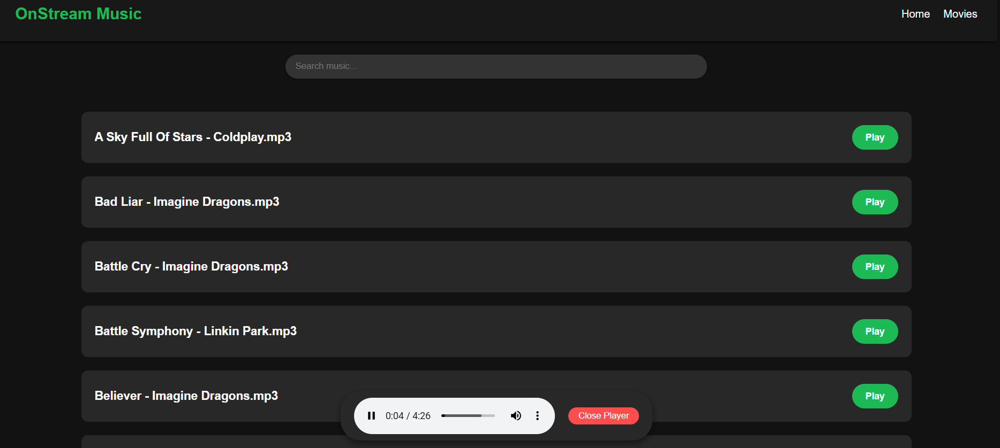

# OnStream — Multimedia Streaming System

A multimedia streaming system capable of delivering music and videos by integrating AWS S3 for cloud-hosted assets and local storage. The system uses WebSockets to ensure real-time catalog synchronization and fast content delivery between the server and clients.

The backend is powered by Node.js, while the frontend provides an adaptive user interface built with HTML, JavaScript, and CSS, allowing users to browse media catalogs and play content directly in the browser.

## Screenshots





## Features

- **Video Streaming**: Stream video content retrieved from AWS S3.
- **Music Streaming**: Stream music from AWS S3 and local server storage.
- **Content Catalog**: Dynamic catalog of available media, updated in real time via WebSockets.
- **Search**: Filter videos and music by name directly in the interface.
- **Real-Time Updates**: Content catalog refreshes automatically every 30 seconds.
- **Cloud Storage**: Multimedia files stored and retrieved via AWS S3.

## Tech Stack

- **Backend**: Node.js, Express
- **Cloud Storage**: AWS S3
- **Real-Time Communication**: WebSockets
- **Frontend**: HTML, JavaScript, CSS

## Project Setup

### Requirements

- Node.js (v14+ recommended)
- npm (comes with Node.js)

### Install Dependencies

Navigate to the websocket folder:
```bash
cd websocket
npm install
```

### Environment Variables

Create a `.env` file inside the websocket folder:
```bash
AWS_ACCESS_KEY_ID=(access-key)
AWS_SECRET_ACCESS_KEY=(secret-key)
AWS_REGION=(aws-region)
BUCKET_NAME=(bucket-name)
```

Replace the values with your actual AWS credentials.

### Running the Server
```bash
node server.js
```

Port 8080 must be available.

### Running the Client

Open the HTML files in the `client` folder directly in a browser. The WebSocket server must be running first.

## Authors

- Josseph Valverde Robles
- Ovidio Martínez Taleno
- Gerson Vargas Gamboa
